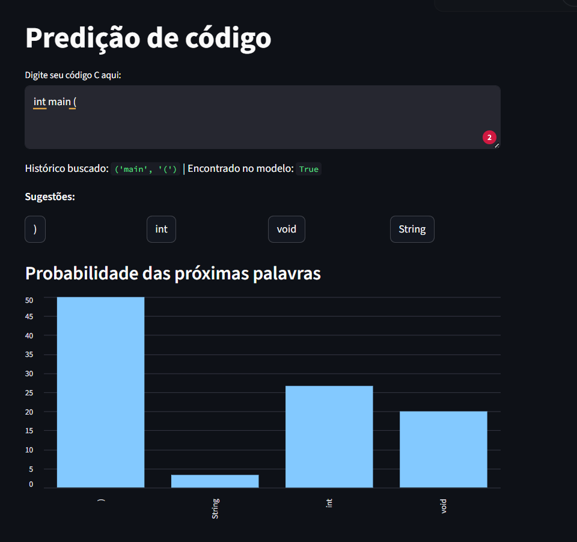
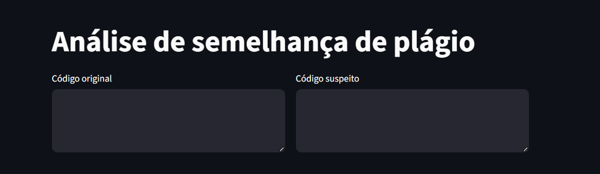
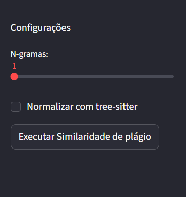
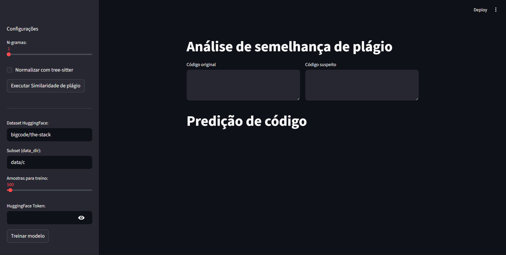
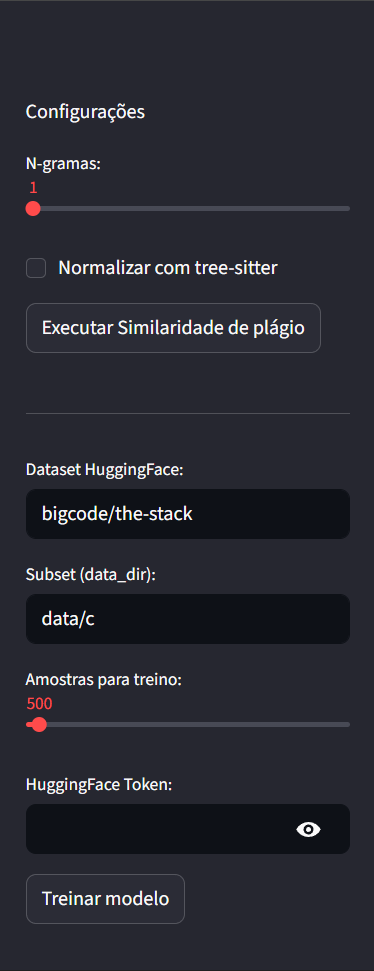

# Modelo de Linguagem N-Grama aplicado a Código-Fonte

[](https://huggingface.co/spaces/Yckson/avaliacao-ia)

Este projeto implementa duas funcionalidades baseadas em n-gramas: detecção de similaridade entre textos (plágio) e predição de tokens em código C. Ambas compartilham a mesma base matemática — Estimativa de Máxima Verossimilhança (MLE) com contagens de co-ocorrência de tokens.

---

## Estrutura do Projeto

```
app.py           — aplicação Streamlit com toda a lógica de n-gramas
requirements.txt — dependências do projeto (inclui tree-sitter para normalização de AST)
dataset/         — arquivos .c usados como referência local
```

---

## Fundamentos: o que é um N-Grama

Um n-grama é uma sequência contígua de n elementos extraídos de um texto. Para n=2 (bigrama), o texto `"int main ( )"` gera os bigramas `("int","main")`, `("main","(")` e `("(",")")`. O modelo armazena com que frequência cada token aparece após cada histórico de (n-1) tokens, e usa essas contagens para estimar probabilidades condicionais.

---

## Comparação entre Pseudocódigo e Implementação

### 1. Geração de N-Gramas

**Pseudocódigo**

```
window <- SUBSEQUENCE(tokens, i, i + n - 1)
```

**Implementação — `ngrams()` (app.py)**

```python
def ngrams(listOfWords, window=3):
    listNgrams = []
    for i in range(0, len(listOfWords) - window + 1):
        windowSlice = listOfWords[i:i+window]   # SUBSEQUENCE
        listNgrams.append(tuple(windowSlice))
    return listNgrams
```

A variável `window` do pseudocódigo corresponde ao parâmetro de mesmo nome na função. O fatiamento `tokens[i:i+window]` é a transcrição direta de `SUBSEQUENCE(tokens, i, i + n - 1)`. O `range` é ajustado para `len - window + 1` exatamente para garantir que só janelas completas sejam geradas — comportamento implícito no pseudocódigo quando o laço termina em `LENGTH(tokens) - n + 1`.

---

### 2. Pré-Processamento e Tokenização

**Pseudocódigo**

```
tokens <- PREPROCESS-AND-TOKENIZE(corpus)
```

**Implementação — `codeTokenizer()` (app.py)**

```python
def codeTokenizer(code):
    return re.findall(r"[\w']+|[.,!?;(){}\[\]=+-/*]", code)
```

O pseudocódigo define PREPROCESS como limpeza do texto (lowercase, remoção de pontuação, etc.). Nesta implementação, o pré-processamento é minimalista: não há conversão para minúsculas nem remoção de pontuação, pois em código-fonte os operadores (`=`, `+`, `{`) são tokens significativos. A expressão regular separa identificadores de operadores, preservando a estrutura sintática do código.

Para a análise de plágio, a função `jaccard()` adiciona `.lower()` antes de tokenizar, aplicando a normalização de caixa prevista em PREPROCESS.

---

### 3. Treinamento do Modelo (TRAIN-NGRAM-MODEL)

**Pseudocódigo**

```
function TRAIN-NGRAM-MODEL(corpus, n) returns a model
    model <- new NGRAM-MODEL
    tokens <- PREPROCESS-AND-TOKENIZE(corpus)
    tokens <- ADD-PADDING(tokens, n-1)
    for i = 1 to LENGTH(tokens) - n + 1 do
        window  <- SUBSEQUENCE(tokens, i, i + n - 1)
        history <- window[1 ... n-1]
        word    <- window[n]
        INCREMENT-COUNT(model.counts, history, word)
        INCREMENT-COUNT(model.context_totals, history)
    return model
```

**Implementação — `trainModel()` (app.py)**

```python
model = defaultdict(lambda: defaultdict(int))   # model.counts + context_totals combinados

for sample in ds:
    tokens = codeTokenizer(code)                # PREPROCESS-AND-TOKENIZE
    for i in range(len(tokens) - n + 1):
        history = tuple(tokens[i:i + n - 1])   # window[1 ... n-1]
        nextW   = tokens[i + n - 1]            # window[n]
        model[history][nextW] += 1             # INCREMENT-COUNT
```

**Diferenças e justificativas**

| Aspecto | Pseudocódigo | Implementação |
|---|---|---|
| Estrutura do modelo | `counts` e `context_totals` separados | Um único dicionário aninhado `model[history][word]` |
| ADD-PADDING | Exigido (`<s>` no início de cada sentença) | Não aplicado |
| Corpus | Parâmetro genérico | Dataset do HuggingFace Hub carregado em streaming |
| Cache | Não mencionado | `@st.cache_resource` evita retreinamento |

**Sobre `counts` vs `context_totals`:** o modelo implementado armazena apenas `counts[history][word]`. O `context_totals[history]` do pseudocódigo é obtido implicitamente somando `sum(model[history].values())` quando necessário para calcular probabilidades. Essa compactação é equivalente matematicamente e evita redundância de dados.

**Sobre ADD-PADDING:** o pseudocódigo recomenda adicionar tokens `<s>` no início de cada sentença para que a primeira palavra tenha um histórico válido. Nesta implementação, o padding não é aplicado. Para arquivos de código com centenas de tokens, os poucos n-gramas iniciais sem histórico completo têm impacto negligenciável no modelo. A omissão simplifica o código sem perda prática de qualidade.

---

### 4. Cálculo de Probabilidade (GET-PROBABILITY)

**Pseudocódigo**

```
function GET-PROBABILITY(model, word, history) returns a probability
    numerator   <- GET-COUNT(model.counts, history, word)
    denominator <- GET-COUNT(model.context_totals, history)
    if denominator = 0 then return 0
    return numerator / denominator
```

**Implementação — cálculo dentro de `nextWord()` e na UI (app.py)**

```python
# Em nextWord(): retorna (word, count) — a divisão é feita na UI
orderedWords = sorted(predictions.items(), key=lambda item: item[1], reverse=True)

# Na UI: calcula P(w | history) para exibir o gráfico
total = sum(count)
prob  = [round(c / total * 100, 2) for c in count]
```

O cálculo de probabilidade está distribuído em dois pontos. A função `nextWord()` retorna as contagens brutas ordenadas (numerador). A divisão pelo total das contagens do histórico (denominador = `context_totals`) é realizada na camada de apresentação para gerar o gráfico de barras. O resultado é idêntico a `GET-PROBABILITY`: `P(w | h) = counts[h][w] / sum(counts[h].values())`.

A verificação `if denominator = 0` do pseudocódigo corresponde a `model.get(currHistory, {})` em `nextWord()`: se o histórico não existir no modelo, retorna um dicionário vazio e a função devolve uma lista vazia, evitando divisão por zero.

---

### 5. Geração de Texto (GENERATE-TEXT)

**Pseudocódigo**

```
function GENERATE-TEXT(model, seed_history, length) returns a string
    output          <- seed_history
    current_history <- seed_history
    for i = 1 to length do
        candidates <- model.VOCABULARY()
        next_word  <- SAMPLE-FROM-DISTRIBUTION(model, candidates, current_history)
        APPEND(output, next_word)
        UPDATE(current_history, next_word)   // desliza a janela
    return output
```

**Implementação — `nextWord()` + UI (app.py)**

```python
def nextWord(model, currText, n=3):
    tokens      = codeTokenizer(currText)
    currHistory = tuple(tokens[-(n-1):])      # UPDATE: pega os últimos (n-1) tokens
    predictions = model.get(currHistory, {})
    orderedWords = sorted(predictions.items(), key=lambda item: item[1], reverse=True)
    return orderedWords[:5]

# Na UI: o usuário escolhe next_word clicando em um botão de sugestão
def append_word(word):
    st.session_state["_code_widget"] += " " + word   # APPEND(output, next_word)
```

**Diferenças e justificativas**

| Aspecto | Pseudocódigo | Implementação |
|---|---|---|
| SAMPLE-FROM-DISTRIBUTION | Amostragem probabilística automática | Usuário escolhe entre as 5 opções mais prováveis |
| Laço automático | `for i = 1 to length` | Cada clique do usuário é uma iteração do laço |
| UPDATE da janela | Desliza o histórico após cada token | `tokens[-(n-1):]` sempre extrai os últimos (n-1) tokens do texto completo |
| seed_history | Parâmetro de entrada da função | Estado inicial fixo `"int main"` no session state |

A implementação transforma a geração automática do pseudocódigo em um loop interativo onde o usuário é o agente de seleção. Isso é mais adequado para um editor de código assistido, pois o desenvolvedor mantém o controle sobre qual sugestão aceitar. O deslizamento da janela (`UPDATE`) é feito implicitamente por `tokens[-(n-1):]`: a cada nova chamada de `nextWord()`, o texto completo é retokenizado e os últimos (n-1) tokens formam o histórico atualizado.



---

## Funcionalidade de Detecção de Plágio

<p>
  
  
</p>

A função `jaccard()` não tem equivalente direto no pseudocódigo fornecido, pois aplica os n-gramas para um objetivo diferente: similaridade de conjuntos em vez de modelagem de linguagem.

```python
def jaccard(text1, text2, window=3):
    set1 = set(ngrams(tokenize(text1), window))
    set2 = set(ngrams(tokenize(text2), window))
    return len(set1 & set2) / len(set1 | set2)
```

Enquanto `trainModel()` usa contagens de n-gramas para estimar probabilidades condicionais, `jaccard()` usa os n-gramas como "impressão digital" do texto: dois textos com muitos n-gramas em comum são provavelmente similares. O índice resultante varia entre 0 (nenhum n-grama em comum) e 1 (conjuntos idênticos).

### Normalização estrutural com tree-sitter

A comparação bruta é sensível a diferenças superficiais: renomear variáveis, trocar constantes ou reformatar o código reduz a similaridade mesmo que a lógica seja idêntica. Para contornar isso, a função `jaccardNormalized()` usa o tree-sitter para parsear o código C e gerar uma sequência normalizada antes de aplicar os n-gramas.

A normalização percorre a AST e substitui tokens pelo seu tipo semântico:

| Token original | Token normalizado |
|---|---|
| `sum`, `i`, `printf` (identificadores) | `ID` |
| `int`, `char` (tipos definidos pelo usuário) | `TYPE` |
| `42`, `3.14`, `true`, `false` | `NUM` |
| `"hello"`, `'a'` | `STR` |
| `// comentário`, `/* bloco */` | ignorado |
| `if`, `while`, `return`, `=`, `+`, `{` | mantido como está |

Assim, dois programas com lógica idêntica mas variáveis renomeadas produzem sequências normalizadas praticamente idênticas — o que aumenta a sensibilidade à detecção de plágio estrutural e reduz falsos negativos.

---

## Executando o Projeto

### Pré-requisitos

- Python 3.9 ou superior
- pip

### Instalação

1. Clone o repositório:

```bash
git clone https://github.com/Yckson/n-grams.git
cd n-gramas
```

2. Crie e ative um ambiente virtual:

```bash
python3 -m venv venv
source venv/bin/activate      # Linux/macOS
venv\Scripts\activate         # Windows
```

3. Instale as dependências:

```bash
pip install -r requirements.txt
```

### Rodando a aplicação

```bash
streamlit run app.py
```

A interface abrirá automaticamente no navegador em `http://localhost:8501`.



### Configuração da barra lateral

| Opção | Descrição |
|---|---|
| N-gramas | Tamanho da janela usada em todas as comparações (1–10) |
| Normalizar com tree-sitter | Ativa a normalização estrutural da AST na comparação de plágio |
| Dataset HuggingFace | Identificador do dataset para treinamento do modelo de predição |
| Subset (data_dir) | Subconjunto do dataset (ex: `data/c` para código C) |
| Amostras para treino | Número de arquivos processados no treinamento |
| HuggingFace Token | Token de acesso para o `bigcode/the-stack` |



> O token HuggingFace também pode ser definido na variável de ambiente `HF_TOKEN` para não precisar digitá-lo na interface.
